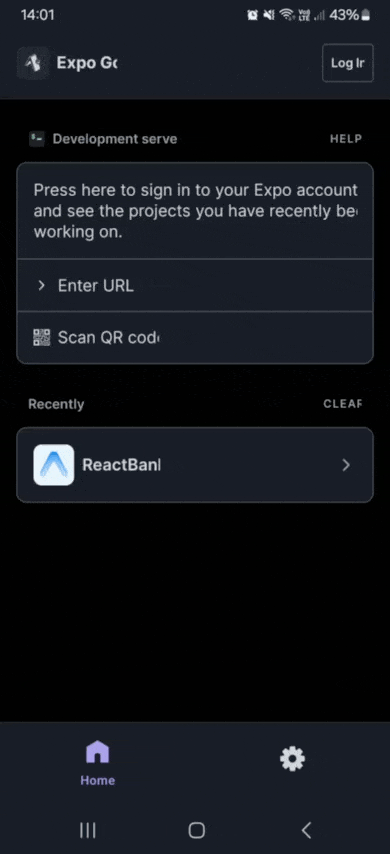

# ReactBank

A mobile banking transaction viewer built as a take-home assessment project. ReactBank allows users to securely authenticate, browse their transaction history, view transaction details, switch display currencies in real time, and export or share a styled receipt image for any transaction.

---

## Table of Contents

1. [Project Overview](#1-project-overview)
2. [Demo](#2-demo)
3. [Features](#3-features)
4. [Tech Stack](#4-tech-stack)
5. [Prerequisites](#5-prerequisites)
6. [Getting Started](#6-getting-started)
7. [Project Structure](#7-project-structure)
8. [Design Decisions](#8-design-decisions)
9. [API Attribution](#9-api-attribution)

---

## 1. Project Overview

ReactBank is a React Native (Expo) mobile app that simulates a personal banking transaction viewer. It was built as part of a take-home technical assessment to demonstrate proficiency in mobile development, state management, API integration, and UI polish.

The core purpose is to give users a secure, readable view of their banking transactions — with the added ability to switch display currencies on the fly, drill into transaction details, and export a professional-looking receipt as an image they can save or share.

---

## 2. Demo

### App Demo

> Replace `demo.gif` below with your actual demo file path after adding it to the repo.



A walkthrough of biometric login, transaction browsing, currency switching, receipt export, and pull to refresh.

_To record a demo, use your device's screen recorder or a tool like [GIPHY Capture](https://giphy.com/apps/giphycapture) (macOS) or [ScreenToGif](https://www.screentogif.com/) (Windows). Place the .gif file in the /assets folder and rename it demo.gif._

---

## 3. Features

### Biometric Authentication
The login screen uses Face ID or Fingerprint via `expo-local-authentication`. If the device does not support biometrics or the user has no enrolled credentials, a graceful fallback message is shown rather than crashing.

### Transaction List Screen
Displays all transactions in a scrollable list. Each card shows the transfer name, recipient name, formatted date, converted amount, and a colour-coded Credit/Debit badge. The list is backed by mock data that simulates a real API response.

### Total Balance Summary Header
A prominent dark blue summary card at the top of the list shows the net total balance across all transactions, a transaction count, and a "last updated" timestamp. The balance automatically reflects the selected display currency.

### Transaction Detail Screen
Tapping any transaction navigates to a detail screen showing all available fields: Reference ID, transfer date, recipient name, transfer type, and the full converted amount. When a non-base currency is selected, the original MYR amount is shown as a subtle subtext for reference.

### Export Transaction Receipt
Each detail screen offers two export actions:
- **Save to Photos** — captures the receipt as a PNG and saves it to the device Camera Roll (requests permission at the point of use)
- **Share Receipt** — opens the native OS share sheet so the receipt can be sent via WhatsApp, email, AirDrop, or any other medium

The receipt is rendered as a styled document off-screen, then captured as an image by `react-native-view-shot`. It reflects the currently selected currency.

### Pull to Refresh
Pulling down on the transaction list triggers a simulated refresh, updating the "last updated" timestamp to show the mechanism is wired end-to-end.

### Universal Currency Conversion
A currency dropdown embedded in the summary header allows switching between **MYR, EUR, GBP, AUD, JPY, HKD,** and **SGD**. Live exchange rates are fetched from the open-source fawazahmed0 Currency API on selection, with a fallback URL for resilience. Converted amounts propagate to every transaction card, the detail screen, and the exported receipt image.

---

## 4. Tech Stack

| Technology | Purpose | Notes |
|---|---|---|
| React Native (Expo) | Core mobile framework | Managed workflow, SDK 54 |
| TypeScript | Type safety | Strict mode enabled |
| Expo Router | File-based navigation | Stack navigation |
| Zustand | Global state management | `transactionStore`, `currencyStore`, `authStore` |
| expo-local-authentication | Biometric auth | Face ID & Fingerprint |
| react-native-view-shot | View to image capture | Used for receipt export |
| expo-media-library | Save image to device | Camera roll access |
| expo-sharing | Native share sheet | Share receipt externally |
| @fawazahmed0/currency-api | Live exchange rates | Open source, CDN-hosted with fallback URL |
| @react-native-picker/picker | Currency dropdown | iOS bottom-sheet modal + Android native dropdown |

---

## 5. Prerequisites

Before running the project, ensure you have the following installed:

- **Node.js** 18 or higher
- **npm** (bundled with Node.js) or **yarn**
- **Expo CLI** — no global install needed; `npx expo` is sufficient
- **Expo Go** app on a physical device, **or** a configured emulator/simulator:
  - iOS Simulator: requires Xcode installed (macOS only)
  - Android Emulator: requires Android Studio with an AVD configured

> **Important:** Biometric authentication (`expo-local-authentication`) requires a **real physical device**. It will not work on simulators or emulators, which have no enrolled biometric credentials.

---

## 6. Getting Started

### Installation

```bash
git clone <repo-url>
cd ReactBank
npm install
```

### Running the App

```bash
npx expo start
```

After the dev server starts, choose your target from the terminal prompt:

- Press `i` to open the iOS Simulator (macOS only, requires Xcode)
- Press `a` to open the Android Emulator (requires Android Studio)
- Scan the QR code with the **Expo Go** app on a physical device *(recommended)*

### Running on a Physical Device (Recommended)

Scanning the QR code with Expo Go is the best way to test all features end-to-end. A physical device is required to test biometric login (Face ID or Fingerprint) and the "Save to Photos" receipt export, both of which depend on hardware capabilities not available in emulators.

---

## 7. Project Structure

```
ReactBank/
├── app/                        # Expo Router screens
│   ├── _layout.tsx             # Root Stack navigator + global header config
│   ├── login.tsx               # Biometric login screen
│   ├── index.tsx               # Transaction list screen (home)
│   └── transaction/
│       └── [id].tsx            # Transaction detail + receipt export
├── assets/
│   └── demo.gif                # App demo recording (add your own)
├── components/
│   ├── TransactionCard.tsx     # List item card with currency-aware amount
│   ├── TransactionReceipt.tsx  # Styled receipt layout for image capture
│   └── CurrencySelector.tsx    # Currency dropdown (iOS modal / Android native)
├── store/
│   ├── transactionStore.ts     # Transaction list, loading, and refresh state
│   ├── currencyStore.ts        # Selected currency, exchange rates, fetch state
│   └── authStore.ts            # Authentication state (isAuthenticated)
├── services/
│   └── exchangeRateService.ts  # Fawazahmed0 API calls with CDN fallback
├── hooks/
│   └── useBiometricAuth.ts     # Biometric authentication hook
├── constants/
│   └── currencies.ts           # Supported currencies, symbols, decimal config
├── utils/
│   └── formatters.ts           # Date and currency formatting helpers
├── data/
│   └── mockTransactions.ts     # Mock transaction data
└── types/
    └── transaction.ts          # TypeScript interfaces for Transaction
```

---

## 8. Design Decisions

**Expo Router over manual navigation setup.** File-based routing means the navigation structure is immediately obvious from the folder layout — no need to trace through a separate navigator file to understand where screens live. It also provides typed route parameters out of the box, which eliminates an entire class of runtime navigation errors.

**Zustand over Redux.** Zustand requires no action/reducer boilerplate and supports async operations directly inside store actions without middleware. The three store slices — `transactionStore`, `currencyStore`, and `authStore` — remain cleanly separated without a combined root reducer. Components subscribe only to the slice they need, so a currency rate fetch does not trigger a re-render in a component that only cares about the auth state.

**Selector pattern for store subscriptions.** Where only a single value is needed from a store (e.g., `isAuthenticated` on the detail screen), a selector function is passed to the hook rather than destructuring the entire store object. This ensures components only re-render when their specific slice of state changes, not on every store update.

**fawazahmed0 Currency API.** This fully open-source API requires no API key, no registration, and is CDN-hosted via jsDelivr with a `currency-api.pages.dev` fallback URL — making it resilient to CDN outages. It is a practical choice for an assessment context where introducing a backend or storing API credentials would add unnecessary friction for reviewers.

**Separation of display label and Picker label in CurrencySelector.** The dropdown Picker items use full descriptive labels (`"£ GBP — British Pound"`) for clarity when the user is making a selection. However, the collapsed button that shows in the summary header derives its own compact label (`"£ GBP ▾"`) independently from the store value, rather than reading back from the selected Picker item. This prevents the full label string from leaking into the header and causing text clipping.

**Off-screen receipt rendering for image export.** The `TransactionReceipt` component is positioned off-screen (`left: -9999, top: -9999`) and rendered invisibly alongside the visible UI. `react-native-view-shot` captures it as a PNG at the moment the user taps "Save to Photos" or "Share Receipt". This approach guarantees the exported image always looks like a clean, full receipt regardless of the current scroll position, screen dimensions, or any UI state that might affect an on-screen capture.

---

## 9. API Attribution

Exchange rate data is provided by the **currency-api** project by [@fawazahmed0](https://github.com/fawazahmed0).

| | |
|---|---|
| **Repository** | https://github.com/fawazahmed0/exchange-api |
| **License** | MIT — free and open source, no API key required |
| **Primary endpoint** | `https://cdn.jsdelivr.net/npm/@fawazahmed0/currency-api@latest/v1/currencies/{base}.json` |
| **Fallback endpoint** | `https://latest.currency-api.pages.dev/v1/currencies/{base}.json` |
